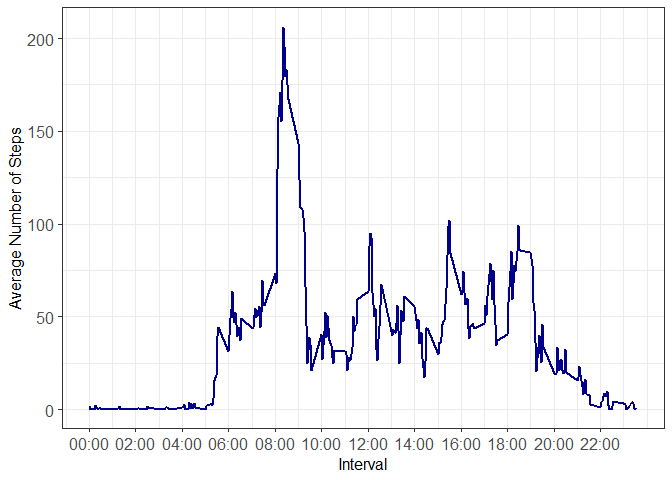

``` r
library(tidyverse)
```

# Loading and preprocessing the data

Create the figures/ directory and unzip the archive containing the data set:

``` r
if (!dir.exists("figures/")) {
        dir.create("figures/")
        unzip("activity.zip", files = "activity.csv")
}
```

Read in the data and drop NAs:

``` r
activity <- read_csv("activity.csv")
activity_no_nas <- activity |> drop_na(steps)
```

# What is mean total number of steps taken per day?

Tibble for the total number of steps taken per day:

``` r
steps_per_day <- activity_no_nas |> 
        group_by(date) |> 
        summarise(total_steps = sum(steps))
```

Mean total number of steps, that is, the mean of the total_steps distribution:

``` r
mean_total_steps <- mean(steps_per_day$total_steps)
mean_total_steps
```

```
## [1] 10766.19
```

Median total number of steps, that is, median of the total_steps distribution:

``` r
median_total_steps <- median(steps_per_day$total_steps)
median_total_steps
```

```
## [1] 10765
```

Histogram for the total_steps distribution:

``` r
pdf(here::here("figures/","histogram_no_nas.pdf"))
g1 <- steps_per_day |> 
        ggplot(aes(x = total_steps)) +
        geom_histogram(binwidth = 2000, fill = "steelblue", color = "white") +
        geom_rug(alpha = 1, linewidth = 0.5) +
        geom_vline(aes(xintercept = mean_total_steps, linetype = "Mean"), 
                   color = "black", linewidth = 1, key_glyph = "path") + 
        scale_linetype_manual(name = "", values = c("Mean" = "solid")) + 
        labs(x = "Total Number of Steps", y = "Count") + 
        theme_bw(base_size = 12) + 
        theme(
                legend.position = c(0.075,0.96),
                axis.text = element_text(size = 12),
                legend.background = element_blank(),
                legend.key = element_blank()
                )
g1
dev.off()
```

```
## png 
##   2
```

``` r
g1
```

<!-- -->

The distribution of total_steps appears to be roughly symmetric, with the mean and median coinciding.

# What is the average daily activity pattern?

Create the tibble for the average number of steps taken, averaged across all days,
and find the 5-minute interval that holds the maximum of the average number of steps taken:

``` r
steps_per_interval <- activity_no_nas |> 
        group_by(interval) |> 
        summarize(average_steps = mean(steps))
steps_per_interval |> slice_max(order_by = average_steps)
```

```
## # A tibble: 1 x 2
##   interval average_steps
##      <dbl>         <dbl>
## 1      835          206.
```

Note that the interval encodes time in **HHMM format** (Hours:Minutes without ":")

Time-series plot of the 5-minute interval and the average number of steps taken, averaged across all days:

``` r
pdf(here::here("figures/","time_series_no_nas.pdf"))
g2 <- steps_per_interval |> 
        ggplot(aes(x = interval, y = average_steps)) +
        geom_line(linewidth = 1, color = "darkblue") + 
        scale_x_continuous(
          breaks = seq(0, 2355, by = 250),
          labels = function(x) sprintf("%02d:%02d", x %/% 100, x %% 100)
        ) + 
        labs(x = "Interval", y = "Average Number of Steps") +
        theme_bw(base_size = 12) + 
        theme(axis.text = element_text(size = 12))
g2
dev.off()
```

```
## png 
##   2
```

``` r
g2
```

<!-- -->

# Imputing missing values

## NA Count in "steps" column of "activity" tibble

Calculate the total number of rows with NAs:

``` r
activity |> filter(is.na(steps)) |> nrow()
```

```
## [1] 2304
```

NAs in "steps" comprise 2,304 rows out of the total 17568 rows, that is, they
represent ~13% of the data in the "steps" column.

## Imputation Strategy

The imputation strategy will depend on the data. The count and the proportion of 
missing values in the "steps" column are important. However, how the way NAs are distributed is even more crucial. That's because, if a pattern exists, then that pattern will eventually inform the choice for the imputation strategy.


``` r
activity |> filter(is.na(steps)) |> group_by(date) |> summarize(na_count_per_date = n())
```

```
## # A tibble: 8 x 2
##   date       na_count_per_date
##   <date>                 <int>
## 1 2012-10-01               288
## 2 2012-10-08               288
## 3 2012-11-01               288
## 4 2012-11-04               288
## 5 2012-11-09               288
## 6 2012-11-10               288
## 7 2012-11-14               288
## 8 2012-11-30               288
```
It is evident that NAs only refer to **specific days** of the data set, that is, 
there are certain days where no measurements were taken.

- 288 = The number of measurements taken each day.
- Since the sampling rate is 5 minutes, the multiplication of 288 with 5 yields 1440, which represents the total amount of minutes in a day.  

Since the measurements of 8 entire days are missing, imputing by the median steps per day is impossible, not to mention unrealistic as activity levels, in general, vary greatly throughout the day. 

Imputing by propagating non-missing values (tidyr::fill()) would yield incorrect results as all the measurements for an entire currently missing date would be sourced from completely different days (either the previous or the next day).The latter would be problematic because propagation is only reasonable if the missing interval resembles its immediate neighbors in time.

The appropriate imputation method for this data set involves imputing by the average (mean/median) number of steps taken at each 5-minute interval, averaged across all days, because this method will closely mirror the daily routine of the individual.

## Imputation Implementation


``` r
activity_imputation <- activity |>
        left_join(steps_per_interval, by = "interval") |> 
        mutate(steps = ifelse(is.na(steps), average_steps, steps)) |> 
        select(-average_steps)

activity_imputation
```

```
## # A tibble: 17,568 x 3
##     steps date       interval
##     <dbl> <date>        <dbl>
##  1 1.72   2012-10-01        0
##  2 0.340  2012-10-01        5
##  3 0.132  2012-10-01       10
##  4 0.151  2012-10-01       15
##  5 0.0755 2012-10-01       20
##  6 2.09   2012-10-01       25
##  7 0.528  2012-10-01       30
##  8 0.868  2012-10-01       35
##  9 0      2012-10-01       40
## 10 1.47   2012-10-01       45
## # i 17,558 more rows
```

## Total Number of Steps Taken per Day, Mean, Median, and Histogram

New tibble for the total number of steps taken per day:

``` r
steps_per_day_imputation <- activity_imputation |> 
        group_by(date) |> 
        summarise(total_steps = sum(steps))
```

New mean total number of steps, that is, the mean of the new total_steps distribution:

``` r
mean_total_steps_imputation <- mean(steps_per_day_imputation$total_steps)
mean_total_steps_imputation
```

```
## [1] 10766.19
```

New median total number of steps, that is, median of the new total_steps distribution:

``` r
median_total_steps_imputation <- median(steps_per_day_imputation$total_steps)
median_total_steps_imputation
```

```
## [1] 10766.19
```

After imputing, the mean and median of the distribution become identical.

Histogram for the new total_steps distribution:

``` r
pdf(here::here("figures/","histogram_imputation.pdf"))
g3 <- steps_per_day_imputation |> 
        ggplot(aes(x = total_steps)) +
        geom_histogram(binwidth = 2000, fill = "steelblue", color = "white") +
        geom_rug(alpha = 1, linewidth = 0.5) +
        geom_vline(aes(xintercept = mean_total_steps_imputation, linetype = "Mean"), 
                   color = "black", linewidth = 1, key_glyph = "path") + 
        scale_linetype_manual(name = "", values = c("Mean" = "solid")) + 
        labs(x = "Total Number of Steps", y = "Count") + 
        theme_bw(base_size = 12) + 
        theme(
                legend.position = c(0.075,0.96),
                axis.text = element_text(size = 12),
                legend.background = element_blank(),
                legend.key = element_blank()
                )
g3
dev.off()
```

```
## png 
##   2
```

``` r
g3
```

<!-- -->
## Impact of Imputation


``` r
library(patchwork)
g1+g3
```

<!-- -->

``` r
combined_tibble <- bind_rows(
        steps_per_day |> mutate(handling_nas = "NAs Ignored"),
        steps_per_day_imputation |> mutate(handling_nas = "NAs Imputed")
)

pdf(here::here("figures/","combined.pdf"))

g4 <- combined_tibble |> 
        ggplot(aes(x = total_steps, color = handling_nas)) +
        geom_density(linewidth = 1, key_glyph = "path") +
        scale_color_manual(
            name = "How NAs Were Handled:",
            values = c("NAs Ignored" = "#009E73", "NAs Imputed" = "#CC79A7")
          ) + 
        labs(x = "Total Number of Steps", y = "Density") + 
        theme_bw(base_size = 12) + 
        theme(
                legend.position = c(0.20,0.80),
                axis.text = element_text(size = 12),
                legend.background = element_blank(),
                legend.key = element_blank()
                )

g4
dev.off()
```

```
## png 
##   2
```

``` r
g4
```

<!-- -->


``` r
summary(steps_per_day$total_steps)
```

```
##    Min. 1st Qu.  Median    Mean 3rd Qu.    Max. 
##      41    8841   10765   10766   13294   21194
```


``` r
IQR(steps_per_day$total_steps)
```

```
## [1] 4453
```


``` r
summary(steps_per_day_imputation$total_steps)
```

```
##    Min. 1st Qu.  Median    Mean 3rd Qu.    Max. 
##      41    9819   10766   10766   12811   21194
```


``` r
IQR(steps_per_day_imputation$total_steps)
```

```
## [1] 2992
```

<u>Results</u>:

- The overall shape of the distribution is preserved.
- The peak around the mean is increased (increased count) since imputation fills the gaps with central tendency values (mean).
- The spread is reduced as evident by the decrease in the value of IQR going from the actual data set to the imputed data set.

# Are there differences in activity patterns between weekdays and weekends?


``` r
pdf(here::here("figures/","panel_plot.pdf"))

g5 <- activity_imputation |> 
        mutate(weekday_vs_weekend = as.factor(ifelse(
                wday(date, label = T) %in% c("Sun","Sat"),"weekend","weekday"))) |> 
        group_by(interval) |> 
        mutate(average_steps = mean(steps)) |> 
        ggplot(aes(x = interval, y = average_steps)) + 
        geom_line(linewidth = 1, color = "darkblue") + 
        scale_x_continuous(
          breaks = seq(0, 2355, by = 250),
          labels = function(x) sprintf("%02d:%02d", x %/% 100, x %% 100)
        ) + 
        labs(x = "Interval", y = "Average Number of Steps") +
        facet_wrap(~weekday_vs_weekend, nrow = 2, strip.position = "top") + 
        theme_bw(base_size = 12) + 
        theme(axis.text = element_text(size = 12))
g5     
dev.off()
```

```
## png 
##   2
```

``` r
g5
```

<!-- -->

There doesn't seem to exist any difference in the activity patterns between weekdays and weekends for this particular individual.
